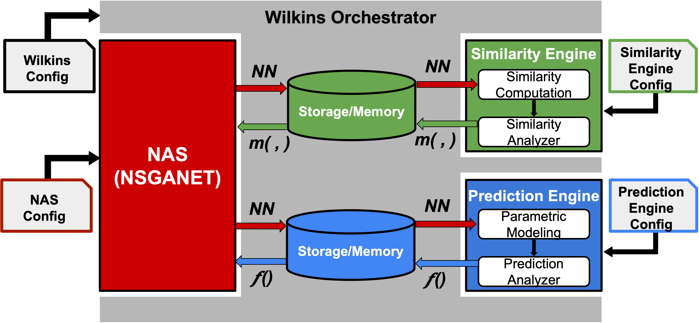

# Analytics for Neural Networks (A4NN)

## About

A4NN is a workflow designed to accelerate Neural Architecture Search (NAS) by integrating analytical engines that enhance search efficiency and reduce training time. A4NN leverages [Wilkins](https://github.com/orcunyildiz/wilkins/) to orchestrate the workflow by launching tasks and establishing communicators between them. The workflow consists of a multi-stage process involving a NAS algorithm, a parametric prediction engine, and a structural similarity engine--each implemented as distinct but interoperable tasks. In this implementation, we use [NSGANet](https://github.com/ianwhale/nsga-net), a multi-objective search algorithm that balances accuracy with computational cost.

This repository includes example task definitions, configuration files, and scripts for running the A4NN workflow. A diagram of the workflow is provided below for reference.

<p align="center"></p>

## Installation 

### Install Spack

1. Clone the Spack repository and checkout version `v0.23.0`:

    ```bash
    git clone https://github.com/spack/spack.git 
    cd spack/
    git checkout tags/v0.23.0
    ```
    Activate Spack:
    ```
    . path/to/spack/share/spack/setup-env.sh
    ```

2. Install `gcc@10.1.0` with Spack and add it to the list of visible compilers:

    ```bash
    spack install gcc@10.1.0
    spack compiler add <path-to-gcc>
    ```
    You can find the path to `gcc@10.1.0` using: 
    ```bash
    spack location -i gcc@10.1.0
    ```
    It is recommended to make `gcc@10.1.0` the only visible compiler. To see a list of visible compilers:
    ```bash
    spack compilers
    ```
    To remove other compilers from this list:
    ```bash
    spack compiler remove <name-of-compiler>
    ```

3. Install Wilkins using Spack. Clone the Wilkins and LowFive repositories and add them to your local Spack repositories:

    ```bash
    cd /path/to/wilkins/
    git clone https://github.com/orcunyildiz/wilkins.git
    spack repo add /path/to/wilkins/

    cd /path/to/lowfive/
    git clone https://github.com/diatomic/LowFive.git
    spack repo add /path/to/lowfive/
    ```
    You can confirm that Spack can find Wilkins and LowFive:
    ```bash
    spack info wilkins
    spack info lowfive
    ```
    Then install Wilkins
    ```bash
    spack install wilkins
    ```

4. Use the `create_env.sh` script in the repository to create a spack environment to run A4NN using Wilkins. Feel free to modify the `env.yaml` to add additional package specs or indicate other package versions.

    ```bash
    # Clone repo and create spack environment
    git clone git@github.com:TauferLab/A4NN_workflow.git
    cd A4NN_workflow/
    source ./create_env.sh
    ```
    PyTorch and several additional libraries must be installed using `pip`. After activating the environment, install these dependencies as follows:
    ```bash
    spack env activate <name-of-the-environment>
    spack load py-pip

    # Install PyTorch for CPU
    python -m pip install torch torchvision torchaudio --index-url https://download.pytorch.org/whl/cpu
    # Or for GPU support (CUDA 11.8)
    python -m pip install torch torchvision torchaudio --index-url https://download.pytorch.org/whl/cu118

    # Install additional libraries
    python -m pip install pydot==2.0.0 igraph==0.11.6
    python -m pip install scikit-learn
    ```

## Running example

We provide an example that demonstrates how to run the A4NN workflow on the CIFAR-10 dataset. This example generates 25 neural network architectures, each trained for 10 epochs, with A4NN performing early termination. Follow the steps below to run the example:

1. Activate the Spack environment and Python virtual environment for the project
    ```
    spack env activate <name-of-the-environment>
    spack load py-pip
    ```

2. Modify the configuration files as needed (e.g., add the corresponding paths). The configuration files are located in the `configs/` directory. A `README` file is included in `configs/`, which describes each configuration field

3. Navigate to the `nas_search/` directory and run the example script:
    ```
    cd /path/to/A4NN_worfklow/nas_search
    source ./run-wilkins-cifar10-example.sh
    ```

## Publications

Kin Wai Ng, Orcun Yildiz, Tom Peterka, Florence Tama, Osamu Miyashita, Catherine Schuman, and Michela Taufer. 2025. **Energy-Efficient Neural Network Training for Scientific Datasets with Advanced Similarity Analytics and Orchestration**. *In Proceedings of the International Conference on Computational Science* (ICCS). Springer, Singapore, 1–15.

## Copyright and License

Copyright (c) 2025, Global Computing Lab

A4NN is distributed under terms of the [Apache License, Version 2.0](https://www.apache.org/licenses/LICENSE-2.0)

See [LICENSE](LICENSE) for more details.

## Acknowledgments

This work was supported by the National Science Foundation (NSF) under grant numbers [#2331152](https://www.nsf.gov/awardsearch/showAward?AWD_ID=2331152&HistoricalAwards=false) and [#2223704](https://www.nsf.gov/awardsearch/showAward?AWD_ID=2223704&HistoricalAwards=false). This work was supported by Advanced Scientific Computing Research, Office of Science, U.S. Department of Energy, under Contract DE-AC02-06CH11357. Any opinions, findings, and conclusions, or recommendations expressed in this material are those of the author(s) and do not necessarily reflect the views of the National Science Foundation. 

Code inspired and modified from [pymoo](https://github.com/msu-coinlab/pymoo), [nsganet](https://github.com/ianwhale/nsga-net/) 
